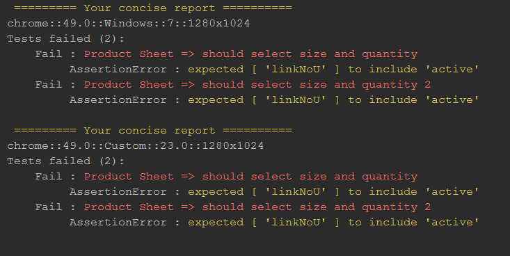
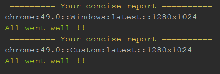

# WDIO Concise Reporter
A concise reporter for WebdriverIO

>This project is derived from [WDIO-Json-Reporter](https://github.com/fijijavis/wdio-json-reporter)




## Installation
```bash
npm install wdio-concise-reporter --save-dev
```

Instructions on how to install `WebdriverIO` can be found
[here](http://webdriver.io/guide/getstarted/install.html).

## Configuration

All is in the title there in no configuration,
we try to keep it as concise as possible
